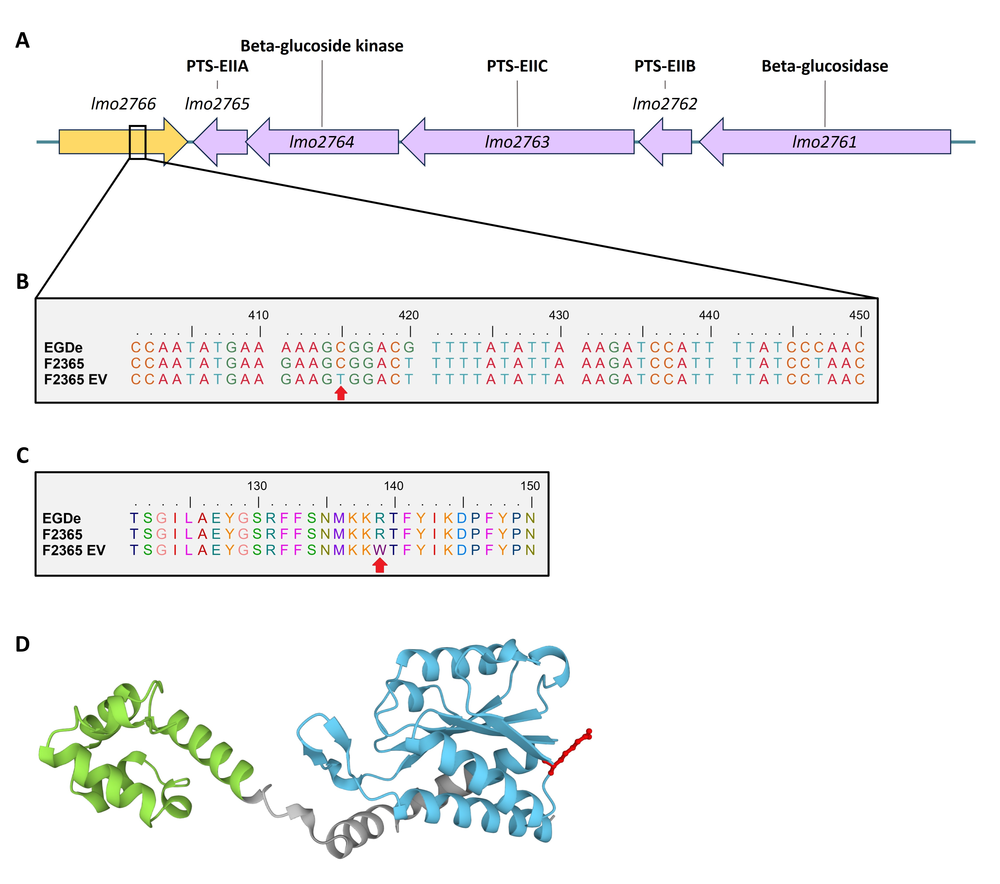
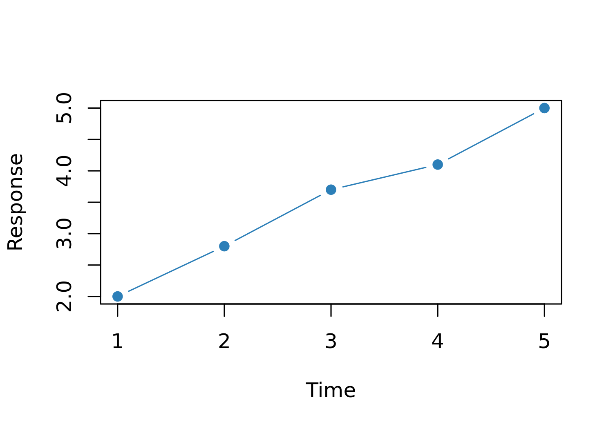
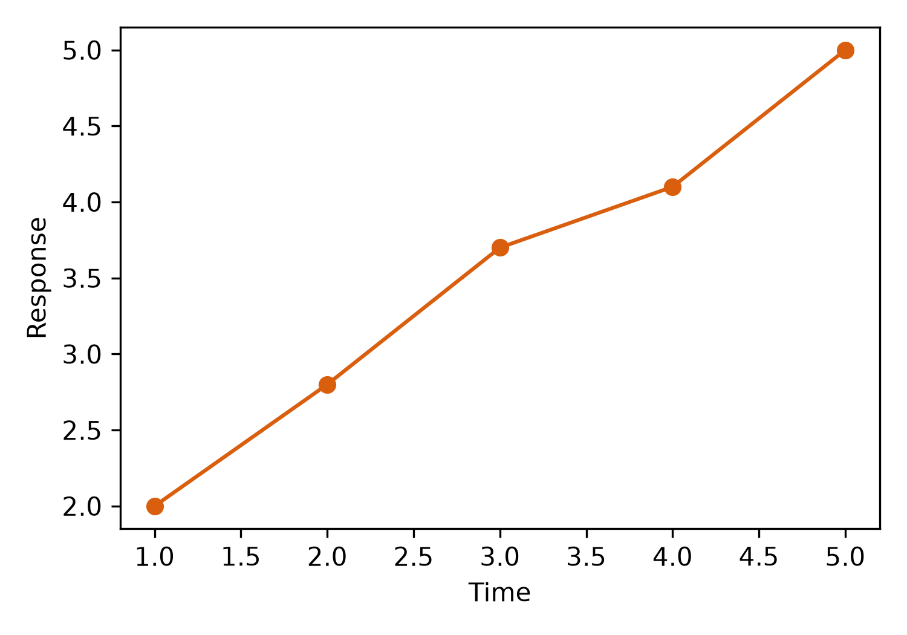



# Abstract {.unnumbered}

Write your abstract here.

**Keywords:** keyword_1; keyword_2; keyword_3



# Highlights {.unnumbered}

- Write highlight 1 here.
- Write highlight 2 here.
- Write highlight 3 here.



# Introduction {#sec-introduction}

Write your introduction here.

Use parenthetical citations such as [@chen2024], narrative citations such as @ma2024lactose, and multiple citations such as [@ma2024lactose; @ma2024sigB; @ren2025]. Replace these example citations with sources relevant to your manuscript.

# Materials and Methods {#sec-materials-methods}

Describe the materials and analysis methods here.

## Method subsection 1 {#sec-materials-methods-1}

Write the first method subsection here.

A table can be included with Markdown style (@tbl-example).

::: {#tbl-example}

| Group     | Sample size | Mean value |
|-----------|------------:|-----------:|
| control   |           3 |       10.2 |
| treatment |           3 |       12.8 |

Example static table.
:::

A table generated from R can also be included, such as @tbl-r-example.

```{r}
#| label: prepare-r-example-table
#| include: false

r_table <- data.frame(
  group = c("control", "treatment"),
  sample_size = c(3, 3),
  mean_value = c(10.2, 12.8)
)
```

::: {#tbl-r-example}
`r knitr::kable(r_table, digits = 1)`

Example table generated from R.
:::

A table generated from Python can also be included, such as @tbl-python-example.

```{python}
#| label: prepare-python-example-table
#| include: false

python_table = {
    "group": ["control", "treatment"],
    "sample_size": [3, 3],
    "mean_value": [10.2, 12.8],
}
```

::: {#tbl-python-example}
`r knitr::kable(as.data.frame(lapply(reticulate::py$python_table, unlist)), digits = 1)`

Example table generated from Python.
:::

An appendix table and figure can be referenced as @tbls-appendix-example and @figs-appendix-example.

## Method subsection 2 {#sec-materials-methods-2}

Write the second method subsection here.

Refer to another section with syntax such as @sec-introduction and @sec-materials-methods-2 when needed.

# Result subsection 1 {#sec-results-1}

Report the results here.

## Result subsection 1

Write the first result subsection here.

A figure can be included from an image file (@fig-example).

::: {#fig-example}
{width="5in"}

Example figure included from an image file.
:::

Figures can be generated with R or Python, and it is recommended to save the figures in advance and use `eval: false` to reduce rendering time.

A figure generated from R (@fig-r-example).

```{r}
#| label: make-r-example-figure
#| eval: false
#| echo: false

x <- 1:5
y <- c(2.0, 2.8, 3.7, 4.1, 5.0)

png(
  "figure/example_fig_r.png",
  width = 5,
  height = 3.5,
  units = "in",
  res = 300
)
plot(x, y, type = "b", pch = 19, col = "#2C7FB8",
     xlab = "Time", ylab = "Response")
dev.off()
```

::: {#fig-r-example}
{width="5in"}

Example figure generated from R and saved at 300 dpi.
:::

A figure generated from Python (@fig-python-example).

```{python}
#| label: make-python-example-figure
#| eval: false
#| echo: false

import matplotlib.pyplot as plt

x = [1, 2, 3, 4, 5]
y = [2.0, 2.8, 3.7, 4.1, 5.0]

fig, ax = plt.subplots(figsize=(5, 3.5))
ax.plot(x, y, marker="o", color="#D95F0E")
ax.set(xlabel="Time", ylabel="Response")
fig.tight_layout()
fig.savefig("figure/example_fig_python.png", dpi=300)
plt.close(fig)
```

::: {#fig-python-example}
{width="5in"}

Example figure generated from Python and saved at 300 dpi.
:::

## Result subsection 2 {#sec-results-2}

Inline code can be used to express analysis results directly in the text.

A simple inline R calculation is 1 + 2 = `r 1 + 2`.

For a more complex calculation, values can first be prepared in a hidden R code chunk.

```{r}
#| label: calculate-r-inline-results
#| include: false

r_values <- c(10.2, 12.1, 11.6, 13.3)
r_sample_size <- length(r_values)
r_mean <- mean(r_values)
```

The mean of `r r_sample_size` values calculated with R is `r sprintf("%.1f", r_mean)`.

Python calculations can also be prepared in a hidden chunk and inserted with an inline R expression through `reticulate`.

```{python}
#| label: calculate-python-inline-results
#| include: false

python_values = [10.2, 12.1, 11.6, 13.3]
python_sample_size = len(python_values)
python_mean = round(sum(python_values) / python_sample_size, 1)
```

The mean of `r reticulate::py$python_sample_size` values calculated with Python is `r reticulate::py$python_mean`.

Inline expressions can also reuse complex text, reducing typing effort and the chance of errors.

```{r}
#| label: set-reusable-scientific-text
#| include: false

lmo <- "*L. monocytogenes*"
ER <- "EGDe *lacR*^887del^ *lmo2766*^C415T^"
```

For example, `r lmo` and `r ER` can be defined once and used consistently throughout the manuscript.

# Discussion {#sec-discussion}

Interpret the findings here.

# Conclusions {#sec-conclusions}

Write the main conclusions here.

# Author Contributions {.unnumbered}

Describe each author's contributions here using the contribution terminology required by the target journal.

# Declaration of Competing Interest {.unnumbered}

Write the competing-interest declaration required by the target journal here.

# Data Availability {.unnumbered}

State where the supporting data can be accessed here.

# Acknowledgments {.unnumbered}

Write acknowledgments and funding information here.

# Declaration of Generative AI and AI-Assisted Technologies {.unnumbered}

If required by the target journal, describe any use of generative AI or AI-assisted technologies during manuscript preparation.



# References {.unnumbered}

::: {#refs}
:::



# Appendices {#sec-appendices .appendix}

Write appendix content here.

::: {#tbls-appendix-example}

| Item       | Description             |
|------------|-------------------------|
| variable_1 | Describe variable 1 here |
| variable_2 | Describe variable 2 here |

Example appendix table caption.
:::

::: {#figs-appendix-example}
{width="5in"}

Example appendix figure caption.
:::
